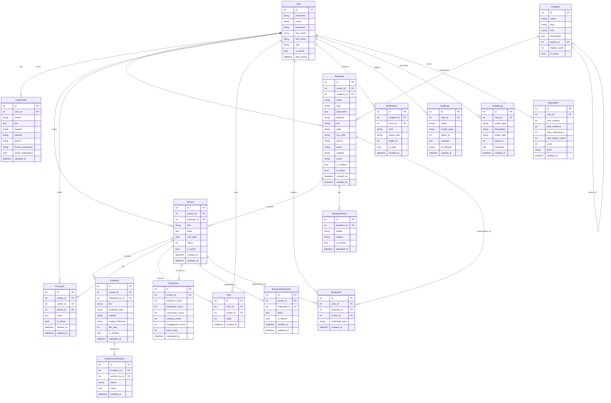

# VeriPoint — Database Schema

> Complete database design for the Evidence-Based Trust Platform.

---

## Table of Contents

1. [ER Diagram](#1-er-diagram)
2. [Models Overview](#2-models-overview)
3. [Detailed Model Definitions](#3-detailed-model-definitions)
4. [Relationships Summary](#4-relationships-summary)
5. [Indexes](#5-indexes)
6. [Normalization Explanation](#6-normalization-explanation)
7. [Expected Query Patterns](#7-expected-query-patterns)
8. [Database Optimization Strategy](#8-database-optimization-strategy)

---

## 1. ER Diagram



---

## 2. Models Overview

| # | Model | App | Purpose |
|---|---|---|---|
| 1 | `User` | accounts | Extended Django user with role field |
| 2 | `UserProfile` | accounts | Profile details, avatar, preferences |
| 3 | `Category` | businesses | Self-referencing categories for businesses |
| 4 | `Business` | businesses | Business listings with owner and category |
| 5 | `BusinessPhoto` | businesses | Gallery photos for businesses |
| 6 | `Review` | reviews | Evidence-based reviews with visit date |
| 7 | `Evidence` | reviews | File attachments proving review claims |
| 8 | `EvidenceVerification` | reviews | Community verification of evidence |
| 9 | `TrustScore` | reviews | Calculated credibility score per review |
| 10 | `Comment` | community | Threaded comments on reviews |
| 11 | `Vote` | community | Upvote/downvote on reviews |
| 12 | `BusinessResponse` | community | Official business replies to reviews |
| 13 | `Bookmark` | community | Saved businesses and reviews |
| 14 | `Notification` | notifications | User notification system |
| 15 | `Reputation` | accounts | Reviewer reputation score |
| 16 | `AuditLog` | moderation | Administrative action log |
| 17 | `ActivityLog` | moderation | User activity tracking |

---

## 3. Detailed Model Definitions

### 3.1 Abstract Base — `TimestampedModel` (core)

Shared by all models that need creation/update timestamps.

```python
# apps/core/models.py

class TimestampedModel(models.Model):
    created_at = models.DateTimeField(auto_now_add=True, db_index=True)
    updated_at = models.DateTimeField(auto_now=True)

    class Meta:
        abstract = True
```

---

### 3.2 `User` (accounts)

Extends Django's `AbstractUser` to add a `role` field.

| Field | Type | Constraints | Notes |
|---|---|---|---|
| `id` | AutoField | PK | Auto-generated |
| `username` | CharField(150) | unique, indexed | Django default |
| `email` | EmailField | unique, indexed | Required for VeriPoint |
| `password` | CharField | hashed | Django default |
| `first_name` | CharField(150) | blank | Django default |
| `last_name` | CharField(150) | blank | Django default |
| `role` | CharField(20) | choices, default='reviewer' | reviewer / business_owner / moderator / admin |
| `is_active` | BooleanField | default=True | Django default |
| `is_staff` | BooleanField | default=False | Django default |
| `date_joined` | DateTimeField | auto_now_add | Django default |

**Choices for `role`:**
```python
ROLE_CHOICES = [
    ('reviewer', 'Reviewer'),
    ('business_owner', 'Business Owner'),
    ('moderator', 'Moderator'),
    ('admin', 'Admin'),
]
```

**Indexes:** `username`, `email`, `role`, `date_joined`

---

### 3.3 `UserProfile` (accounts)

One-to-one extension of `User` for non-auth profile data.

| Field | Type | Constraints | Notes |
|---|---|---|---|
| `id` | AutoField | PK | |
| `user` | OneToOneField(User) | on_delete=CASCADE, related_name='profile' | |
| `avatar` | ImageField | upload_to='avatars/', blank, null | Profile photo |
| `bio` | TextField | max_length=500, blank | Short biography |
| `location` | CharField(100) | blank | City/State |
| `website` | URLField | blank | Personal website |
| `phone` | CharField(20) | blank | Contact phone |
| `theme_preference` | CharField(10) | choices, default='system' | light / dark / system |
| `email_notifications` | BooleanField | default=True | Email notification toggle |
| `updated_at` | DateTimeField | auto_now | |

**Created via Django signal on User creation.**

---

### 3.4 `Category` (businesses)

Self-referencing hierarchical categories.

| Field | Type | Constraints | Notes |
|---|---|---|---|
| `id` | AutoField | PK | |
| `name` | CharField(100) | unique | Category name |
| `slug` | SlugField(100) | unique, indexed | URL-safe name |
| `icon` | CharField(50) | blank | Lucide icon name |
| `description` | TextField | blank | Category description |
| `parent` | ForeignKey(self) | null, blank, on_delete=SET_NULL, related_name='children' | Parent category |
| `display_order` | PositiveIntegerField | default=0 | Ordering |
| `is_active` | BooleanField | default=True | Soft delete |

**Indexes:** `slug`, `is_active`, `display_order`

---

### 3.5 `Business` (businesses)

Core business listing model.

| Field | Type | Constraints | Notes |
|---|---|---|---|
| `id` | AutoField | PK | |
| `owner` | ForeignKey(User) | null, blank, on_delete=SET_NULL, related_name='businesses' | Business owner |
| `category` | ForeignKey(Category) | on_delete=PROTECT, related_name='businesses' | Primary category |
| `name` | CharField(200) | indexed | Business name |
| `slug` | SlugField(200) | unique, indexed | URL-safe name |
| `description` | TextField | | Detailed description |
| `short_description` | CharField(300) | blank | Tagline / summary |
| `address` | CharField(300) | | Street address |
| `city` | CharField(100) | indexed | City |
| `state` | CharField(100) | blank | State/Province |
| `zip_code` | CharField(20) | blank | Postal code |
| `phone` | CharField(20) | blank | Phone number |
| `email` | EmailField | blank | Contact email |
| `website` | URLField | blank | Business website |
| `hours` | JSONField | default=dict, blank | Operating hours as JSON |
| `is_verified` | BooleanField | default=False, indexed | Verified business |
| `is_active` | BooleanField | default=True, indexed | Soft delete |
| `created_at` | DateTimeField | auto_now_add, indexed | |
| `updated_at` | DateTimeField | auto_now | |

**Indexes:** `slug`, `name`, `city`, `is_verified`, `is_active`, `created_at`, `category_id`

**Composite Indexes:** `(category, is_active)`, `(city, is_active)`

---

### 3.6 `BusinessPhoto` (businesses)

Gallery photos for businesses.

| Field | Type | Constraints | Notes |
|---|---|---|---|
| `id` | AutoField | PK | |
| `business` | ForeignKey(Business) | on_delete=CASCADE, related_name='photos' | |
| `image` | ImageField | upload_to='business_photos/' | Photo file |
| `caption` | CharField(200) | blank | Photo caption |
| `is_primary` | BooleanField | default=False | Primary display photo |
| `uploaded_at` | DateTimeField | auto_now_add | |

**Indexes:** `business_id`, `is_primary`

---

### 3.7 `Review` (reviews)

Core review model — the heart of VeriPoint.

| Field | Type | Constraints | Notes |
|---|---|---|---|
| `id` | AutoField | PK | |
| `author` | ForeignKey(User) | on_delete=CASCADE, related_name='reviews' | Reviewer |
| `business` | ForeignKey(Business) | on_delete=CASCADE, related_name='reviews' | Reviewed business |
| `title` | CharField(200) | | Review headline |
| `body` | TextField | | Review content |
| `visit_date` | DateField | null, blank | Date of visit/purchase |
| `rating` | PositiveSmallIntegerField | validators=[1-5] | Traditional 1-5 rating (secondary to trust score) |
| `is_edited` | BooleanField | default=False | Marks if review was edited |
| `is_active` | BooleanField | default=True, indexed | Soft delete |
| `created_at` | DateTimeField | auto_now_add, indexed | |
| `updated_at` | DateTimeField | auto_now | |

**Constraints:**
- Unique together: `(author, business)` — one review per user per business
- `rating` must be between 1 and 5

**Indexes:** `author_id`, `business_id`, `is_active`, `created_at`, `rating`

**Composite Indexes:** `(business, is_active, created_at)`, `(author, is_active)`

---

### 3.8 `Evidence` (reviews)

File attachments proving review claims.

| Field | Type | Constraints | Notes |
|---|---|---|---|
| `id` | AutoField | PK | |
| `review` | ForeignKey(Review) | on_delete=CASCADE, related_name='evidence_items' | Parent review |
| `uploaded_by` | ForeignKey(User) | on_delete=CASCADE, related_name='uploaded_evidence' | Uploader |
| `file` | FileField | upload_to='evidence/%Y/%m/' | Evidence file |
| `evidence_type` | CharField(20) | choices, indexed | photo / invoice / receipt / document / screenshot |
| `caption` | CharField(300) | blank | Evidence description |
| `original_filename` | CharField(255) | | Original upload filename |
| `file_size` | PositiveIntegerField | | File size in bytes |
| `is_verified` | BooleanField | default=False, indexed | Community verified |
| `uploaded_at` | DateTimeField | auto_now_add, indexed | |

**Choices for `evidence_type`:**
```python
EVIDENCE_TYPE_CHOICES = [
    ('photo', 'Photo'),
    ('invoice', 'Invoice'),
    ('receipt', 'Receipt'),
    ('document', 'Document'),
    ('screenshot', 'Screenshot'),
]
```

**Validation Rules:**
- Max file size: 10 MB
- Allowed extensions: `.jpg`, `.jpeg`, `.png`, `.gif`, `.webp`, `.pdf`
- Max 10 evidence items per review

**Indexes:** `review_id`, `evidence_type`, `is_verified`, `uploaded_at`

---

### 3.9 `EvidenceVerification` (reviews)

Community members verify evidence authenticity.

| Field | Type | Constraints | Notes |
|---|---|---|---|
| `id` | AutoField | PK | |
| `evidence` | ForeignKey(Evidence) | on_delete=CASCADE, related_name='verifications' | Evidence being verified |
| `verified_by` | ForeignKey(User) | on_delete=CASCADE, related_name='evidence_verifications' | Verifier |
| `status` | CharField(20) | choices | authentic / suspicious / inconclusive |
| `notes` | TextField | blank | Optional explanation |
| `created_at` | DateTimeField | auto_now_add | |

**Choices for `status`:**
```python
VERIFICATION_STATUS_CHOICES = [
    ('authentic', 'Authentic'),
    ('suspicious', 'Suspicious'),
    ('inconclusive', 'Inconclusive'),
]
```

**Constraints:**
- Unique together: `(evidence, verified_by)` — one verification per user per evidence

**Indexes:** `evidence_id`, `verified_by_id`, `status`

---

### 3.10 `TrustScore` (reviews)

Calculated credibility score per review.

| Field | Type | Constraints | Notes |
|---|---|---|---|
| `id` | AutoField | PK | |
| `review` | OneToOneField(Review) | on_delete=CASCADE, related_name='trust_score' | |
| `evidence_score` | PositiveSmallIntegerField | default=0 | 0–40 points |
| `reputation_score` | PositiveSmallIntegerField | default=0 | 0–20 points |
| `community_score` | PositiveSmallIntegerField | default=0 | 0–20 points |
| `recency_score` | PositiveSmallIntegerField | default=0 | 0–10 points |
| `engagement_score` | PositiveSmallIntegerField | default=0 | 0–10 points |
| `total_score` | PositiveSmallIntegerField | default=0, indexed | 0–100 total |
| `calculated_at` | DateTimeField | auto_now | Last calculation time |

**Scoring Formula:**
```
total_score = evidence_score + reputation_score + community_score + recency_score + engagement_score
```

**Score Breakdown:**

| Component | Max | Calculation |
|---|---|---|
| Evidence | 40 | `min(40, evidence_count * 8 + type_diversity_bonus)` |
| Reputation | 20 | Based on author's `Reputation.score`, scaled to 0–20 |
| Community | 20 | `min(20, (upvotes - downvotes) * 2)`, floor 0 |
| Recency | 10 | Decays over 365 days from review creation |
| Engagement | 10 | `5` if has comments + `5` if has business response |

**Indexes:** `review_id`, `total_score`

---

### 3.11 `Comment` (community)

Threaded comments on reviews.

| Field | Type | Constraints | Notes |
|---|---|---|---|
| `id` | AutoField | PK | |
| `review` | ForeignKey(Review) | on_delete=CASCADE, related_name='comments' | |
| `author` | ForeignKey(User) | on_delete=CASCADE, related_name='comments' | |
| `parent` | ForeignKey(self) | null, blank, on_delete=CASCADE, related_name='replies' | For threading |
| `body` | TextField | max_length=2000 | Comment content |
| `is_active` | BooleanField | default=True | Soft delete |
| `created_at` | DateTimeField | auto_now_add, indexed | |
| `updated_at` | DateTimeField | auto_now | |

**Indexes:** `review_id`, `author_id`, `parent_id`, `is_active`, `created_at`

---

### 3.12 `Vote` (community)

Upvote (+1) or downvote (−1) on reviews.

| Field | Type | Constraints | Notes |
|---|---|---|---|
| `id` | AutoField | PK | |
| `user` | ForeignKey(User) | on_delete=CASCADE, related_name='votes' | Voter |
| `review` | ForeignKey(Review) | on_delete=CASCADE, related_name='votes' | Voted review |
| `value` | SmallIntegerField | choices=[(1, 'Up'), (-1, 'Down')] | Vote direction |
| `created_at` | DateTimeField | auto_now_add | |

**Constraints:**
- Unique together: `(user, review)` — one vote per user per review
- `value` must be 1 or -1

**Indexes:** `user_id`, `review_id`

---

### 3.13 `BusinessResponse` (community)

Official business replies to reviews.

| Field | Type | Constraints | Notes |
|---|---|---|---|
| `id` | AutoField | PK | |
| `review` | OneToOneField(Review) | on_delete=CASCADE, related_name='business_response' | One response per review |
| `responder` | ForeignKey(User) | on_delete=CASCADE, related_name='business_responses' | Business owner/rep |
| `body` | TextField | max_length=5000 | Response content |
| `is_official` | BooleanField | default=True | Marks official responses |
| `created_at` | DateTimeField | auto_now_add | |
| `updated_at` | DateTimeField | auto_now | |

**Indexes:** `review_id`, `responder_id`

---

### 3.14 `Bookmark` (community)

Users save businesses or reviews for later.

| Field | Type | Constraints | Notes |
|---|---|---|---|
| `id` | AutoField | PK | |
| `user` | ForeignKey(User) | on_delete=CASCADE, related_name='bookmarks' | |
| `business` | ForeignKey(Business) | null, blank, on_delete=CASCADE, related_name='bookmarks' | Bookmarked business |
| `review` | ForeignKey(Review) | null, blank, on_delete=CASCADE, related_name='bookmarks' | Bookmarked review |
| `bookmark_type` | CharField(20) | choices | business / review |
| `created_at` | DateTimeField | auto_now_add | |

**Choices for `bookmark_type`:**
```python
BOOKMARK_TYPE_CHOICES = [
    ('business', 'Business'),
    ('review', 'Review'),
]
```

**Constraints:**
- Unique together: `(user, business)` for business bookmarks
- Unique together: `(user, review)` for review bookmarks
- Enforced via model validation: exactly one of `business` or `review` must be set

**Indexes:** `user_id`, `business_id`, `review_id`, `bookmark_type`

---

### 3.15 `Notification` (notifications)

Flexible notification system using generic targeting.

| Field | Type | Constraints | Notes |
|---|---|---|---|
| `id` | AutoField | PK | |
| `recipient` | ForeignKey(User) | on_delete=CASCADE, related_name='notifications' | Who receives it |
| `actor` | ForeignKey(User) | null, blank, on_delete=SET_NULL, related_name='actions' | Who triggered it |
| `verb` | CharField(100) | | Action description (e.g., "reviewed your business") |
| `notification_type` | CharField(30) | choices, indexed | review / comment / vote / response / verification / system |
| `target_type` | CharField(50) | blank | Model name of target (e.g., "review", "business") |
| `target_id` | PositiveIntegerField | null, blank | PK of target object |
| `is_read` | BooleanField | default=False, indexed | Read status |
| `created_at` | DateTimeField | auto_now_add, indexed | |

**Choices for `notification_type`:**
```python
NOTIFICATION_TYPE_CHOICES = [
    ('review', 'New Review'),
    ('comment', 'New Comment'),
    ('vote', 'New Vote'),
    ('response', 'Business Response'),
    ('verification', 'Evidence Verified'),
    ('system', 'System'),
]
```

**Indexes:** `recipient_id`, `is_read`, `created_at`, `notification_type`

**Composite Index:** `(recipient, is_read, created_at)` — most common query pattern

---

### 3.16 `Reputation` (accounts)

Aggregated reviewer reputation.

| Field | Type | Constraints | Notes |
|---|---|---|---|
| `id` | AutoField | PK | |
| `user` | OneToOneField(User) | on_delete=CASCADE, related_name='reputation' | |
| `total_reviews` | PositiveIntegerField | default=0 | Number of reviews written |
| `total_evidence` | PositiveIntegerField | default=0 | Total evidence items uploaded |
| `total_verifications` | PositiveIntegerField | default=0 | Evidence verified by community |
| `total_helpful_votes` | PositiveIntegerField | default=0 | Net upvotes received |
| `score` | PositiveIntegerField | default=0, indexed | Calculated reputation score |
| `level` | CharField(20) | choices, default='newcomer' | Reputation tier |
| `updated_at` | DateTimeField | auto_now | |

**Choices for `level`:**
```python
LEVEL_CHOICES = [
    ('newcomer', 'Newcomer'),         # 0–49
    ('contributor', 'Contributor'),   # 50–149
    ('trusted', 'Trusted'),           # 150–299
    ('expert', 'Expert'),             # 300–499
    ('authority', 'Authority'),       # 500+
]
```

**Reputation Formula:**
```
score = (total_reviews * 10) + (total_evidence * 5) + (total_verifications * 15) + (total_helpful_votes * 3)
```

**Created via Django signal on User creation.**

**Indexes:** `user_id`, `score`, `level`

---

### 3.17 `AuditLog` (moderation)

Tracks administrative and moderation actions.

| Field | Type | Constraints | Notes |
|---|---|---|---|
| `id` | AutoField | PK | |
| `user` | ForeignKey(User) | null, on_delete=SET_NULL, related_name='audit_logs' | Actor |
| `action` | CharField(50) | indexed | create / update / delete / moderate / verify |
| `model_name` | CharField(100) | | Target model name |
| `object_id` | PositiveIntegerField | | Target object PK |
| `changes` | JSONField | default=dict, blank | JSON diff of changes |
| `ip_address` | GenericIPAddressField | null, blank | Request IP |
| `created_at` | DateTimeField | auto_now_add, indexed | |

**Indexes:** `user_id`, `action`, `model_name`, `created_at`

---

### 3.18 `ActivityLog` (moderation)

Tracks user activity for analytics and moderation.

| Field | Type | Constraints | Notes |
|---|---|---|---|
| `id` | AutoField | PK | |
| `user` | ForeignKey(User) | null, on_delete=SET_NULL, related_name='activity_logs' | Actor |
| `action_type` | CharField(50) | indexed | login / review / vote / comment / search / view |
| `description` | CharField(300) | blank | Human-readable description |
| `target_type` | CharField(50) | blank | Target model name |
| `target_id` | PositiveIntegerField | null, blank | Target object PK |
| `metadata` | JSONField | default=dict, blank | Extra context (search terms, etc.) |
| `created_at` | DateTimeField | auto_now_add, indexed | |

**Indexes:** `user_id`, `action_type`, `created_at`

---

## 4. Relationships Summary

```
User (1) ←→ (1) UserProfile          OneToOne
User (1) ←→ (1) Reputation           OneToOne
User (1) ←→ (N) Business             ForeignKey (owner)
User (1) ←→ (N) Review               ForeignKey (author)
User (1) ←→ (N) Comment              ForeignKey (author)
User (1) ←→ (N) Vote                 ForeignKey (user)
User (1) ←→ (N) Bookmark             ForeignKey (user)
User (1) ←→ (N) Notification         ForeignKey (recipient)
User (1) ←→ (N) AuditLog             ForeignKey (user)
User (1) ←→ (N) ActivityLog          ForeignKey (user)

Category (1) ←→ (N) Category         Self-referencing ForeignKey (parent)
Category (1) ←→ (N) Business         ForeignKey (category)

Business (1) ←→ (N) Review           ForeignKey (business)
Business (1) ←→ (N) BusinessPhoto    ForeignKey (business)
Business (1) ←→ (N) Bookmark         ForeignKey (business)

Review (1) ←→ (N) Evidence           ForeignKey (review)
Review (1) ←→ (1) TrustScore         OneToOne
Review (1) ←→ (N) Comment            ForeignKey (review)
Review (1) ←→ (N) Vote               ForeignKey (review)
Review (1) ←→ (1) BusinessResponse   OneToOne
Review (1) ←→ (N) Bookmark           ForeignKey (review)

Evidence (1) ←→ (N) EvidenceVerification   ForeignKey (evidence)
```

---

## 5. Indexes

### Primary Indexes (Automatic)
Every model's `id` field is automatically indexed as the primary key.

### Foreign Key Indexes
Django automatically creates indexes on all ForeignKey fields.

### Explicit Indexes

| Model | Field(s) | Type | Reason |
|---|---|---|---|
| `User` | `email` | Unique | Login lookup |
| `User` | `role` | Standard | Filter by role |
| `Category` | `slug` | Unique | URL lookup |
| `Category` | `is_active` | Standard | Filter active categories |
| `Business` | `slug` | Unique | URL lookup |
| `Business` | `name` | Standard | Search |
| `Business` | `city` | Standard | Location filter |
| `Business` | `is_verified` | Standard | Filter verified |
| `Business` | `is_active` | Standard | Filter active |
| `Business` | `created_at` | Standard | Sort by newest |
| `Business` | `(category, is_active)` | Composite | Category listing page |
| `Business` | `(city, is_active)` | Composite | Location-based search |
| `Review` | `is_active` | Standard | Filter active |
| `Review` | `created_at` | Standard | Sort by newest |
| `Review` | `rating` | Standard | Filter/sort by rating |
| `Review` | `(business, is_active, created_at)` | Composite | Business reviews page |
| `Review` | `(author, is_active)` | Composite | User's reviews page |
| `Evidence` | `evidence_type` | Standard | Filter by type |
| `Evidence` | `is_verified` | Standard | Filter verified |
| `Evidence` | `uploaded_at` | Standard | Sort by date |
| `TrustScore` | `total_score` | Standard | Sort by credibility |
| `Comment` | `is_active` | Standard | Filter active |
| `Comment` | `created_at` | Standard | Sort by date |
| `Notification` | `is_read` | Standard | Unread filter |
| `Notification` | `created_at` | Standard | Sort by date |
| `Notification` | `notification_type` | Standard | Filter by type |
| `Notification` | `(recipient, is_read, created_at)` | Composite | Main notification query |
| `Reputation` | `score` | Standard | Leaderboard sorting |
| `Reputation` | `level` | Standard | Filter by tier |
| `AuditLog` | `action` | Standard | Filter by action type |
| `AuditLog` | `created_at` | Standard | Sort by date |
| `ActivityLog` | `action_type` | Standard | Filter by action |
| `ActivityLog` | `created_at` | Standard | Sort by date |

---

## 6. Normalization Explanation

### First Normal Form (1NF) ✅
- All fields contain atomic values.
- No repeating groups or arrays (except JSONField for structured data like `hours` and `changes`).
- Every table has a primary key.

### Second Normal Form (2NF) ✅
- All non-key fields are fully dependent on the primary key.
- No partial dependencies (all tables use single-column PKs).

### Third Normal Form (3NF) ✅
- No transitive dependencies.
- `TrustScore` contains calculated fields, but these are cached computations recalculated on demand — not transitive dependencies.
- `Reputation` similarly caches aggregate data for performance, recalculated via signals.

### Denormalization Decisions

| Field | Model | Rationale |
|---|---|---|
| `total_score` | TrustScore | Avoid recomputing on every page load. Recalculated on events. |
| `score`, `total_*` | Reputation | Avoid expensive aggregate queries on leaderboard. Updated via signals. |
| `is_edited` | Review | Quick boolean check without querying update history. |
| `file_size` | Evidence | Avoid filesystem stat calls; stored on upload. |
| `original_filename` | Evidence | Preserved for display since Django renames uploaded files. |

These are **intentional, controlled denormalizations** with clear update triggers. They trade minimal storage for significant query performance gains.

---

## 7. Expected Query Patterns

### High-Frequency Queries

| Query | Used On | Optimization |
|---|---|---|
| Business list by category | Category page | Composite index `(category, is_active)` + `select_related('category')` |
| Reviews for a business | Business profile | Composite index `(business, is_active, created_at)` + `prefetch_related('evidence_items', 'trust_score')` |
| Unread notification count | Navbar (every page) | Composite index `(recipient, is_read)` + `.count()` |
| User's own reviews | Profile page | Composite index `(author, is_active)` + `select_related('business')` |
| Leaderboard | Leaderboard page | Index on `Reputation.score` + `.order_by('-score')[:20]` |
| Business search by name/city | Search page | Indexes on `name`, `city` + `Q()` objects |
| Trust score for review | Review card | OneToOne `select_related('trust_score')` |

### Medium-Frequency Queries

| Query | Used On | Optimization |
|---|---|---|
| Vote count for review | Review card | `Vote.objects.filter(review=r).aggregate(Sum('value'))` |
| Comment thread for review | Review detail | `prefetch_related('comments__author')` |
| Business photos | Business profile | `prefetch_related('photos')` |
| User bookmarks | Bookmarks page | `select_related('business', 'review')` |
| Evidence verifications | Evidence viewer | `prefetch_related('verifications__verified_by')` |

### Low-Frequency Queries

| Query | Used On | Optimization |
|---|---|---|
| Audit log listing | Admin dashboard | Index on `created_at` + pagination |
| Activity log | Admin dashboard | Index on `created_at` + pagination |
| Reputation recalculation | On review/vote events | Denormalized fields + signal-based update |

---

## 8. Database Optimization Strategy

### 1. Query Optimization
```python
# BAD: N+1 query
for review in Review.objects.all():
    print(review.author.username)  # Separate query per review

# GOOD: Eager loading
reviews = Review.objects.select_related('author', 'business').all()
for review in reviews:
    print(review.author.username)  # No extra query
```

### 2. Prefetch for Reverse Relations
```python
# GOOD: Prefetch evidence and votes
reviews = Review.objects.prefetch_related(
    'evidence_items',
    'comments__author',
    'votes',
    Prefetch('trust_score'),
).select_related(
    'author__profile',
    'business',
)
```

### 3. Aggregation Over Iteration
```python
# BAD: Counting in Python
count = len(Review.objects.filter(business=b))

# GOOD: Database-level count
count = Review.objects.filter(business=b, is_active=True).count()

# GOOD: Multiple aggregates
from django.db.models import Avg, Count, Sum
stats = Review.objects.filter(business=b).aggregate(
    avg_rating=Avg('rating'),
    review_count=Count('id'),
    total_votes=Sum('votes__value'),
)
```

### 4. Pagination
All list views use Django's `Paginator`:
```python
from django.core.paginator import Paginator
paginator = Paginator(queryset, 12)  # 12 items per page
page = paginator.get_page(page_number)
```

### 5. Conditional Updates
```python
# Update reputation without loading the full object
Reputation.objects.filter(user=user).update(
    total_reviews=F('total_reviews') + 1,
    score=F('score') + 10,
)
```

### 6. SQLite-Specific Optimizations
```python
# In settings.py — enable WAL mode for better concurrent reads
DATABASES = {
    'default': {
        'ENGINE': 'django.db.backends.sqlite3',
        'NAME': BASE_DIR / 'db.sqlite3',
        'OPTIONS': {
            'init_command': 'PRAGMA journal_mode=WAL; PRAGMA synchronous=NORMAL;',
        },
    }
}
```

### 7. Caching Strategy
- Template fragment caching for expensive renders (leaderboard, trending)
- Session-based caching for user-specific data (unread notification count)
- Denormalized fields for frequently accessed aggregates

---

*This schema is designed for SQLite3 but is fully compatible with PostgreSQL migration via Django ORM abstraction.*
